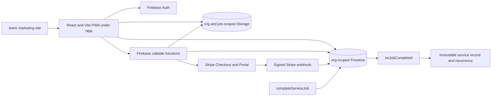

# Astra execution brief — finish FieldLedger's non-hosting production work

Historical planning document. The approved build has since progressed; use `docs/production-build-progress.md` and `release-evidence/acceptance.json` for current implementation and verification status before treating any item below as unfinished.

Copy this entire document into the new Astra chat.

---

You are working only on FieldLedger at:

`A:\Projects\SaaS\FieldLedger`

The portfolio root is:

`A:\Projects\SaaS`

## Objective

Finish every implementation, automated-test, documentation, and local/staging-ready acceptance item that does **not** require provisioning or mutating live cloud infrastructure. FieldLedger must become a credible **local production candidate** for a specialized service-business operating system.

Do not stop after builds pass. Implement the missing multi-user business workflow, server-authoritative job lifecycle, evidence durability, account lifecycle, entitlement enforcement, authorization coverage, and executable E2E acceptance suite.

At the end, FieldLedger may be labeled `local-candidate` only if every required local gate below passes. It may not be labeled `production-ready` without a deployed authenticated production canary and buyer-artifact evidence.

## User direction

- The user is discontinuing parallel work on TradeOS, Quorum, and BuildLedger.
- FieldLedger is now the sole product priority.
- The strategic direction is an operating system for a real service business, not an AI feature collection or generic SaaS template.
- Optimize for one narrow, repeated operational loop: customer/site/asset setup → scheduled work → technician execution → photo-backed service record → recurrence and export.
- Preserve all three configuration-driven verticals, but do not expand their scope. Treat commercial kitchen hood cleaning as the first commercialization hypothesis unless the user explicitly selects another. Continue using extinguisher fixtures where they already provide stronger test coverage. Do not make unverified regulatory claims for any vertical.

## Required workspace rules

1. Read `A:\Projects\SaaS\AGENTS.md` and any descendant `AGENTS.md` before editing.
2. Use the smallest relevant workspace skills, including TDD, Firebase architecture, API interface design, frontend design, and deployment preflight when their triggers apply.
3. Inspect current files before changing them. Existing edits belong to the user or another agent.
4. Use `apply_patch` for edits.
5. Follow red-green-refactor for every defect or new contract: first add a test that fails for the missing behavior, then implement it, then rerun the focused and full suites.
6. Do not modify TradeOS, Quorum, BuildLedger, Stanley, Bridgeway, or unrelated portfolio products.
7. Do not deploy, create Firebase projects, create Stripe resources, modify DNS, send email, use real customer data, or place secrets in files.
8. Do not weaken App Check, Firestore rules, Storage rules, authorization, or validation to make tests pass.
9. Do not restore direct Stripe Payment Links or demo fallbacks in production mode.
10. Do not publish files under `seo/review-pending/`; they contain unverified claims and remain excluded.
11. Preserve the current customer-facing name `FieldLedger` and canonical domain until an authorized deployment/domain decision.
12. Never describe a local result as deployed, commercially validated, or production ready.

## Current verified state

Reinspect this state rather than assuming it remains unchanged:

- `release-manifest.json` currently says `status: "prototype"`.
- `firebase.provisionedProjects` is empty.
- `STRIPE_STARTER_PRICE_ID` is null.
- `.firebaserc` contains staging/production aliases but no shared `bridgeway-db29e` default.
- The live production path currently fails closed with “Production configuration required.”
- The explicit fictional demo works.
- A current local `npm.cmd run verify` passed 39 tests, all integrated builds, the manifest audit, eight marketing pages, and `/app/` packaging.
- A saved Firestore emulator log reports 19/19 tests, but `firestore.rules` was modified after that log. The final ruleset therefore needs an independent rerun.
- A stale Java Firestore-emulator process was observed holding `127.0.0.1:8685`. Verify the exact process identity before stopping it. Never terminate an unknown Java process merely to free the port.
- The current app includes Firebase Auth, password reset, Firestore persistent local cache, App Check, tenant-scoped data subscriptions, Storage uploads, server-authoritative completion, reports, export, Stripe Checkout/Portal code, and webhook idempotency work.
- Missing customer-critical behavior includes invitations, team management, real technician assignment, complete account deletion, final E2E evidence, and production/staging canaries.

## Current architecture to preserve



Important current entry points:

- `apps/fieldledger/src/App.tsx`
- `apps/fieldledger/src/context/OperationsContext.tsx`
- `apps/fieldledger/src/lib/firebase.ts`
- `functions/src/api/createOrganization.ts`
- `functions/src/api/completeServiceJob.ts`
- `functions/src/security/authorize-request.ts`
- `functions/src/webhooks/stripeWebhook.ts`
- `functions/src/triggers/onJobCompleted.ts`
- `firestore.rules`
- `storage.rules`
- `release-manifest.json`
- `release-evidence/acceptance.json`

## Non-hosting definition of done

FieldLedger may be promoted to `local-candidate` only when all of the following are true:

1. An owner can register, resume interrupted onboarding, create a company, and verify their email.
2. An owner can invite a manager or technician with a one-time expiring invitation.
3. The invited person can create/sign into their own account, accept only an invitation sent to their verified email, and join exactly one authorized organization.
4. Owners can manage owners/managers/technicians within defined constraints; managers can manage technicians but never owners/managers.
5. The three-technician Starter entitlement is enforced server-side.
6. An owner or manager can add customers, sites, and assets; schedule a job; and assign it to an active technician.
7. A technician can see and operate only jobs they are authorized to perform.
8. Job state transitions are validated server-side and every meaningful transition creates an immutable audit event.
9. Required checklist results and photo evidence are validated against the current job, site, asset, organization, and workflow before completion.
10. Evidence remains retryable across transient network failure and cannot be attached across tenants/jobs/assets.
11. A completed service record is deterministic, idempotent, immutable, source-traceable, downloadable/printable, and still present after logout/relogin.
12. Trial/subscription entitlements and seat limits are enforced by trusted server state, not URL parameters or browser state.
13. Export and deletion requests exist and are authorization-tested.
14. Firestore and Storage emulator suites cover every role and all cross-tenant negative cases.
15. A real browser E2E suite completes owner and technician journeys using Firebase emulators at desktop and 390×844 mobile viewports.
16. `verify:local-candidate` runs all local gates and records evidence without inferring staging or production success.
17. Product, security, privacy, offline, billing, and compliance copy matches the actual implementation.

## Milestone order

Complete milestones in this order. Do not skip ahead to visual polish while an earlier security or workflow gate is failing.

---

## M0 — establish a trustworthy baseline and test ladder

### Implementation

1. Inspect the current tree and generated artifacts. Record which files were modified after the existing evidence logs.
2. Run the current unit/build/release audit:

   ```powershell
   $env:ASTRO_TELEMETRY_DISABLED='1'
   npm.cmd run verify
   ```

3. Resolve the emulator-port conflict safely:
   - Check `netstat -ano | Select-String ':8685'`.
   - Resolve the owning PID.
   - Verify it is the stale `demo-fieldledger-rules` Firestore emulator before stopping it.
   - If identity cannot be verified, do not kill it. Make the dedicated test harness use a safely configurable port instead.
4. Add first-class root scripts:
   - `test:rules`
   - `test:functions`
   - `test:e2e`
   - `verify:local-candidate`
   - `evidence:local-candidate`
5. Expand `firebase.json` or a dedicated emulator config to include Auth, Firestore, Storage, Functions, and Hosting for E2E tests. Use only a fixed `demo-` project.
6. Make `verify:local-candidate` run, in order:
   - core unit/contract tests;
   - functions tests;
   - Firestore rules tests;
   - Storage rules tests;
   - integrated production build;
   - release-manifest and SEO/GEO audit;
   - emulator-backed E2E suite.
7. Refactor `record-release-evidence.mjs` so `acceptance.json` updates each local check from the actual command result and timestamp. It must leave staging, production canary, billing live canary, backup restore, and buyer artifact as `not-run` unless independently executed.
8. Add source hashes or timestamps for rules and builds to prevent stale logs from being counted against newer files.

### Required tests

- Red test proving a rules log is rejected when its recorded rules hash differs from the current file.
- Red test proving a green build cannot promote status when rules or E2E are missing.
- Red test proving a `bridgeway-db29e` or non-allowlisted deploy target fails before Firebase invocation.

### Exit gate

- One command deterministically proves or rejects the local candidate.
- No stale evidence is counted.
- Baseline status remains `prototype` until later milestones pass.

---

## M1 — implement secure invitations and team management

The advertised Starter plan supports up to three technicians, but there is no usable invitation/team-management workflow. Implement it before calling the product a business operating system.

### Data model

Use server-owned invitation records such as:

`orgs/{orgId}/invitations/{invitationId}`

Required fields:

- `orgId`
- normalized `email`
- `role`: `manager | technician`
- `tokenHash` — never store the raw token
- `status`: `pending | accepted | revoked | expired`
- `createdBy`
- `createdAt`
- `expiresAt`
- `acceptedBy` and `acceptedAt` when applicable
- `revokedBy` and `revokedAt` when applicable

Do not expose `tokenHash` through normal client reads. Prefer callable responses that return sanitized invitation summaries.

### Callable interfaces

Add strict Zod-validated, App-Check-enforced callables:

1. `createMemberInvitation({ orgId, email, role })`
   - owner may invite managers or technicians;
   - manager may invite technicians only;
   - reject existing active member, duplicate live invitation, unsupported role, and entitlement overflow;
   - generate a cryptographically strong one-time token;
   - store only its hash;
   - return the invitation link/token exactly once for manual pilot delivery until an authorized email provider is added.
2. `acceptMemberInvitation({ token })`
   - require authenticated and verified email;
   - compare normalized verified email to the invitation;
   - transactionally verify pending/unexpired/unrevoked state and seat availability;
   - reject users already attached to another organization unless multi-org support is deliberately implemented;
   - create `orgs/{orgId}/users/{uid}` and `account_workspaces/{uid}`;
   - mark the invitation accepted;
   - update custom claims after the transaction and require token refresh.
3. `revokeMemberInvitation({ orgId, invitationId })`
4. `updateMemberRole({ orgId, userId, role })`
5. `setMemberActive({ orgId, userId, active })`
6. `removeOrganizationMember({ orgId, userId })`

### Authorization invariants

- Membership documents become server-written only. Change browser writes under `/orgs/{orgId}/users/{userId}` to `allow write: if false` once the callables exist.
- Owners cannot demote, disable, or remove themselves through this path.
- Managers cannot create/update/delete owners or managers.
- Technicians cannot invite or manage anybody.
- Disabled users lose data and Storage access immediately even if token claims are stale.
- Membership documents—not custom claims—remain authoritative.
- `maxTechnicians` is enforced transactionally on invitation and acceptance to prevent races.
- A canceled/expired entitlement cannot add members unless the chosen grace policy allows it.

### UI

Add a Team section accessible to owners/managers:

- members, role, active state, and invitation status;
- invite manager/technician form;
- copy one-time invite link action with a clear security warning;
- revoke pending invitation;
- change role/disable/remove actions only when authorized;
- seat usage display such as `2 of 3 technicians`;
- empty/loading/error/expired invitation states;
- invitation-acceptance route that survives authentication redirect.

Do not add automated email sending in this milestone.

### Required tests

- Owner invites manager and technician.
- Manager invites technician.
- Manager cannot invite/manage owner or manager.
- Technician cannot create/revoke invitations.
- Wrong email cannot accept.
- Unverified email cannot accept.
- Expired, revoked, and already-used tokens fail.
- Raw token is absent from Firestore.
- Concurrent acceptance cannot exceed seat limits.
- Disabled member loses Firestore, Storage, and callable access.
- Owner cannot remove the final owner/self.
- Cross-tenant invitation IDs and tokens disclose no tenant data.

### Exit gate

Two real emulator Auth users can join the same organization through the invitation flow without direct database seeding.

---

## M2 — implement a server-authoritative assignment and job lifecycle

The current client creates jobs assigned to `user?.uid`, which makes the owner the technician. Replace that shortcut with a real business workflow.

### Job model

Required statuses:

`scheduled -> dispatched -> in_progress -> completed`

Allowed terminal/exception status:

`scheduled | dispatched | in_progress -> cancelled`

Completed and cancelled jobs cannot be reopened silently. Corrections must create a revision or explicit void/replacement record.

Required job fields:

- `id`, `orgId`, `vertical`, `customerId`, `siteId`
- `assignedTechId`
- `scheduledDate` and explicit timezone
- `status`
- `createdBy`, `createdAt`, `updatedBy`, `updatedAt`
- `startedBy`, `startedAt`
- `completedBy`, `completedAt`
- `cancelledBy`, `cancelledAt`, `cancellationReason`
- `version` for optimistic concurrency

### Server interfaces

Add strict callables or transaction-backed server handlers:

1. `createServiceJob`
2. `assignServiceJob`
3. `startServiceJob`
4. `cancelServiceJob`
5. retain and harden `completeServiceJob`

Rules:

- owner/manager schedules, assigns, reassigns, and cancels;
- assigned technician may start and complete only their job;
- technician cannot change assignment/customer/site/vertical;
- assignee must be active, in the same organization, and a technician or explicitly authorized operator role;
- customer, site, and asset relationships must be verified server-side;
- mutations use preconditions/version checks to reject stale edits;
- every transition creates a server-owned event under `orgs/{orgId}/jobs/{jobId}/events/{eventId}`;
- event IDs are deterministic or idempotency-keyed where retry duplication is possible.

### UI

- Add active-team technician selector to scheduling.
- Add unassigned/assigned filters for owners/managers.
- Add technician-specific “My work” view.
- Show current assignee and immutable status history.
- Add explicit start and cancel interactions.
- Handle reassignment while a technician has the job open.
- Never show another technician's job to an unauthorized technician.

### Required tests

- Active same-org technician can be assigned.
- Disabled, nonexistent, manager-only if disallowed, and cross-org user cannot be assigned.
- Technician sees/starts/completes assigned job only.
- Technician cannot reassign or cancel unless explicitly allowed.
- Illegal state transitions fail.
- Stale version update fails.
- Repeated completion is idempotent and creates one record/event.
- Browser cannot forge completed status, `completedBy`, or timestamps.
- Organization vertical cannot change through a job mutation.

### Exit gate

Separate owner and technician browser sessions operate one persisted job from scheduling through completion with no seeded membership or assignment.

---

## M3 — make evidence durable, private, and retry-safe

The current result model stores Firebase download URLs. Replace this with durable evidence references and verify evidence on the server.

### Evidence model

Create server-validated evidence metadata, for example:

`orgs/{orgId}/jobs/{jobId}/evidence/{evidenceId}`

Fields:

- `id`, `orgId`, `jobId`, `assetId`
- `storagePath`
- `contentType`, `sizeBytes`, `sha256` when available
- `status`: `uploading | ready | rejected | deleted`
- `uploadedBy`, `uploadedAt`
- `validatedAt`, `validationVersion`
- optional capture timestamp supplied by device, clearly distinguished from server upload time

Store `storagePath` in service results, not a bearer-like download URL. Resolve display access through authenticated Storage SDK access governed by rules.

### Upload behavior

- Use a client-generated evidence ID and deterministic path so retries do not create uncontrolled duplicates.
- Persist queued upload intent and file/blob in IndexedDB when practical and within browser quota.
- Show `queued`, `uploading`, `retrying`, `ready`, and `failed` states.
- Use bounded exponential retry with explicit user retry/cancel controls; no endless retry loops.
- A job cannot complete until all required evidence is `ready`.
- Completion must verify each evidence record belongs to the same org/job/asset and the underlying Storage object exists with accepted content type/size/metadata.
- Reject path traversal, foreign URLs, arbitrary external URLs, spoofed MIME types, and metadata mismatches.
- Decide and document whether photos are required per checklist item or per asset; enforce the configured rule consistently.

### Storage rules

- Narrow the current broad `orgs/{orgId}/{allPaths=**}` match to explicit evidence paths.
- Technicians may create/update evidence only for assigned active jobs.
- Owners/managers may read and delete according to retention policy.
- Prevent overwrite after evidence becomes part of a completed record.
- Add tests for file size, MIME type, foreign path, inactive member, wrong assignee, and completed-job mutation.

### Required tests

- Network interruption and retry result in one evidence record.
- Same file retry is idempotent.
- Cross-org/job/asset attachment fails.
- Missing or rejected Storage object blocks completion.
- Unsupported type and oversize file fail in client and rules/server validation.
- Completed evidence cannot be replaced silently.
- Logout/relogin preserves queued/ready state appropriately without leaking data between accounts on a shared browser.

### Exit gate

A mobile emulator/browser can interrupt and resume a real image upload, then complete exactly one valid service record.

---

## M4 — make reports, recurrence, and exports auditable

### Service-record invariants

- Use a deterministic report identity derived from the job, such as `reports/{jobId}`, unless a versioned design is required.
- Make `onJobCompleted` idempotent under trigger retry.
- Ensure one completed job creates one initial service record and one intended recurrence action.
- Record the organization/workflow configuration version used to produce the record.
- Include source job ID, customer/site/asset IDs, evidence storage paths, technician identity, timestamps, results, exceptions, and disclaimer.
- Prevent client writes to reports and recurrence queues.
- A correction creates `report revisions` or a void/replacement chain; it never mutates the original record invisibly.
- Make all dates timezone-explicit and deterministic.

### Export

- Return a schema-versioned export containing organization, members excluding secrets, customers, sites, assets, jobs, events, reports, deficiencies, workflow configuration, and evidence metadata.
- Paginate or stream safely for organizations exceeding 500 jobs.
- Do not export signed Storage URLs as durable identifiers.
- Add a visible export action with progress and failure handling.
- Record who requested the export and when.

### Required tests

- Trigger retry creates no duplicate report or recurrence item.
- Out-of-order trigger/event delivery does not regress asset dates.
- All expected assets are included exactly once.
- Unresolved/inaccessible assets produce an incomplete or exception outcome, never a compliance certification.
- Export is tenant-scoped and schema-valid.
- Technician export permissions match the explicit role matrix.
- Large pagination does not omit or duplicate records.

### Exit gate

The same immutable record and export are visible after logout/relogin and in a separate authorized browser session.

---

## M5 — complete authentication, onboarding, and account lifecycle

### Registration and recovery

- Send email verification after registration.
- Do not permit invitation acceptance or real operations until email ownership is verified, except for a clearly defined limited onboarding state.
- Handle the partial-failure case where Auth account creation succeeds but organization creation fails. The user must be able to sign back in and resume `createWorkspace` safely.
- Keep password-reset responses enumeration-resistant.
- Add useful handling for expired session, disabled account, changed role, and revoked membership.
- Require recent authentication for account deletion and other destructive identity actions.

### Onboarding

- Collect real company profile fields rather than writing `Not configured`, `NA`, and `00000` placeholders into production organization records.
- Validate phone/address/state/postal fields without pretending every market uses the same jurisdiction format.
- Explain that the selected service vertical is fixed for the workspace unless support performs a controlled migration.
- Provide a short first-run checklist: company → team → customer/site → asset → job.

### Deletion and retention

Implement server-authorized requests for:

- export current organization data;
- delete the individual account when safe;
- request organization deletion by an owner;
- cancel a pending deletion during a defined grace period, if adopted.

Document and test cascade/tombstone behavior for Firestore, Storage evidence, Auth identities, Stripe linkage, reports, and audit logs. Preserve only legally/operationally justified records for a documented period. Do not claim immediate deletion if asynchronous cleanup remains.

### Required tests

- Unverified email restrictions.
- Interrupted registration resumes without duplicate organization.
- Password reset gives safe responses.
- Disabled/revoked member is logged out or loses access promptly.
- Non-owner cannot request organization deletion.
- Deletion/export cannot target another organization.
- Deletion job is retry-safe and leaves no unexpected user-accessible records.

### Exit gate

Fresh registration, verification fixture, onboarding, recovery, export, and deletion-request paths pass in emulator-backed browser tests.

---

## M6 — finish entitlement and billing behavior without provisioning Stripe

Do not create Stripe products or use live/test secrets in this task. Complete the code and deterministic test harness so external configuration is the only remaining billing dependency.

### Entitlement model

Define one authoritative server-side entitlement policy for:

- `not_started`
- `trialing`
- `active`
- `past_due`
- `canceled`
- `expired`

Settle the 14-day trial behavior:

- trial start timestamp;
- trial end timestamp;
- allowed features during trial;
- grace behavior;
- exact behavior after expiration;
- whether cancellation remains active through period end.

Do not rely on UI badges or Checkout success URLs. Functions and sensitive writes must consult trusted organization entitlement fields.

### Billing hardening

- Inject or wrap the Stripe client so Checkout, Portal, and webhook behavior can be tested without network access.
- Validate application return URLs against an allowlist from configuration.
- Ensure Checkout request idempotency and abandoned-attempt expiry are tested.
- Verify Stripe customer/subscription ownership before Portal or entitlement changes.
- Atomically claim webhook events.
- Retrieve current subscription state for out-of-order events.
- Handle at least:
  - checkout completion;
  - asynchronous payment success/failure if applicable;
  - subscription created/updated/deleted;
  - invoice paid;
  - invoice payment failed.
- Test duplicate delivery, concurrent delivery, retry after partial failure, and stale event ordering.
- Enforce the technician seat limit from server entitlement state.
- Keep billing unavailable in explicit demo mode.

### Required tests

- Trial creation/expiration at deterministic clock boundaries.
- Active/past-due/canceled/expired feature access.
- Success URL alone grants nothing.
- Cross-org Checkout/Portal fails.
- Duplicate Checkout request returns or blocks predictably.
- Duplicate/concurrent webhook changes state once.
- Old event cannot revive canceled subscription.
- Seat-count race cannot exceed `maxTechnicians`.
- Missing Stripe configuration fails closed with a useful error.

### Exit gate

Billing contract tests cover the complete lifecycle with fixtures/mocks. `release-manifest.json` must still keep the Price ID null until a real Stripe Price is verified externally.

---

## M7 — build the real browser acceptance suite

Use Playwright unless a suitable existing E2E framework is discovered. Do not substitute component tests for browser workflows.

### Emulator topology

Run against a fixed demo project with:

- Auth emulator
- Firestore emulator
- Storage emulator
- Functions emulator
- Hosting or local integrated build

Use isolated test users and organization IDs per test. Provide deterministic cleanup.

### Required browser journeys

#### Journey A — owner onboarding

1. Create account.
2. Satisfy emulator email-verification flow.
3. Create organization and select vertical.
4. Complete company profile.
5. Sign out and back in.
6. Confirm the same organization loads.

#### Journey B — team onboarding

1. Owner creates technician invitation.
2. Technician creates/signs into separate account.
3. Technician accepts the invitation.
4. Owner sees technician and seat count.
5. Technician cannot access Team administration.

#### Journey C — complete business workflow

1. Owner creates customer and site.
2. Owner adds multiple representative assets.
3. Owner schedules and assigns technician.
4. Technician opens “My work.”
5. Technician starts the job.
6. Technician records every required checklist field.
7. Technician uploads a real generated test image.
8. Technician completes the job.
9. Owner sees the completed status and immutable service record.
10. Owner downloads/prints or validates the report output.
11. Both accounts log out/reload and the record remains.

#### Journey D — isolation

1. Create a second organization and users.
2. Attempt direct Firestore reads/writes using known IDs from the first organization.
3. Attempt Storage reads/writes and callable requests using the first organization's IDs.
4. Assert permission denial without revealing sensitive record contents.

#### Journey E — failure recovery

- interrupted onboarding;
- duplicate invite acceptance;
- upload interruption/retry;
- duplicate completion click;
- revoked member with open tab;
- stale job version;
- expired trial.

### Device coverage

- Desktop Chromium.
- Chromium at exactly 390×844.
- Where the environment permits, test a real camera/file input path rather than toggling demo state.
- Verify keyboard navigation, visible focus, dialog focus trapping, labels, and status/error announcements.

### Exit gate

All journeys pass against final local source and final rules. Screenshots are supplementary evidence; assertions and persisted-state checks are required.

---

## M8 — operational and policy readiness artifacts

Create implementation-backed operational documents and safe scripts, but do not claim to have run cloud operations that require unprovisioned infrastructure.

### Required artifacts

- `docs/INCIDENT_RESPONSE.md`
- `docs/BACKUP_RESTORE.md`
- `docs/DATA_RETENTION_DELETION.md`
- `docs/RELEASE_ROLLBACK.md`
- `docs/SUPPORT_RUNBOOK.md`
- `docs/ROLE_PERMISSION_MATRIX.md`
- `docs/BILLING_LIFECYCLE.md`
- `docs/PRODUCTION_CANARY.md`

Each runbook must include owner, trigger, exact procedure, evidence to record, rollback/stop condition, and what remains impossible before provisioning.

### Product/legal copy audit

- Re-audit marketing, app, manifest, `llms.txt`, JSON-LD, privacy, terms, and security pages.
- Keep `seo/review-pending` unpublished.
- Remove or qualify unsupported claims including “certifies compliance,” “tamper-proof,” guaranteed offline completion, automatic customer delivery, or regulatory approval.
- Distinguish cached app/data access from successfully uploading evidence while offline.
- Define what an acknowledgment/signature means if one is added; do not imply a statutory e-signature without implementing and reviewing that contract.
- Ensure hood cleaning, extinguisher, and grease trap pages describe operator-entered service records, not legal certification.

### Exit gate

Every published capability maps to a passing test or a clearly stated boundary.

---

## M9 — final local candidate certification

### Required commands

Run focused tests after each milestone, then the final sequence:

```powershell
$env:ASTRO_TELEMETRY_DISABLED='1'
npm.cmd run verify:local-candidate
node ..\policy-verification\audit-release-manifest.mjs
```

Run the portfolio source-policy suite only as a regression check; do not modify other products to make it pass.

### Evidence requirements

Update `release-evidence/acceptance.json` with exact results and timestamps for:

- unit tests;
- functions tests;
- final Firestore rules hash and test result;
- final Storage rules hash and test result;
- build;
- release audit;
- E2E desktop;
- E2E 390×844;
- local cross-tenant canary;
- dependency scan, or a precise blocker if network authorization prevents it.

Leave these as `not-run` or `blocked` until they actually occur:

- provisioned staging project;
- staging authenticated canary;
- verified Stripe Price and webhook;
- live billing lifecycle;
- production deployment;
- production authenticated canary;
- production backup/restore rehearsal;
- real buyer artifact;
- paid-pilot outcome.

### Status rule

Set `release-manifest.json` to `local-candidate` only if every non-hosting definition-of-done item passes. Otherwise leave it `prototype` and name the exact failures.

Never set `production-ready` locally.

---

## External work that must remain explicit

These are not Astra-local completion items and must not be fabricated:

1. Provision `fieldledger-stg` and `fieldledger-prod` or record the actual approved project IDs.
2. Enable/configure Firebase Auth, Firestore, Storage, Functions, Hosting, App Check, Scheduler, and billing.
3. Register hosting targets and the canonical domain.
4. Configure production environment values and App Check key.
5. Create/verify Stripe Product and recurring Price.
6. Store Stripe secrets and register the signed webhook endpoint.
7. Run staging authentication, persistence, authorization, upload, billing, export, deletion, and rollback canaries.
8. Run the production signup-to-cleanup canary.
9. Complete production backup/restore rehearsal.
10. Obtain operator review for the chosen first vertical's workflow and claims.
11. Onboard a pilot buyer with a representative, permissioned artifact.

## Commercialization boundary

The codebase can become a local production candidate without customer interviews. The product is not commercially validated until intended operators demonstrate recurring use and willingness to pay.

Keep the first commercial experiment narrow:

- one service vertical;
- one repeated service-stop workflow;
- one owner/dispatcher and one or more technicians;
- real customer/site/asset records with permission;
- completed photo-backed service records;
- repeated use over multiple jobs;
- explicit paid-pilot decision.

Do not expand into CRM, accounting, route optimization, generic AI, customer portals, or enterprise analytics until the core service-record workflow is repeatedly used.

## Required progress reporting

After every milestone, report:

1. Milestone ID and status.
2. Files and public interfaces changed.
3. The failing test added first.
4. Focused test command and result.
5. Full verification command and result when applicable.
6. Browser workflow exercised.
7. Environment: local unit, emulator, local browser, staging, or production.
8. Remaining blockers.
9. Current release disposition.

Do not use “done,” “complete,” “production ready,” “customer ready,” or “launched” unless the corresponding evidence gate in this document has actually passed.

## Final response format

When the implementation work ends, provide:

- **Outcome:** achieved, partially achieved, or blocked.
- **Release disposition:** prototype or local-candidate.
- **Implemented milestones:** M0–M9 individually.
- **Verification table:** command, result, test count, environment, evidence path.
- **Customer workflow evidence:** exact owner/technician browser journey completed.
- **Security evidence:** Firestore, Storage, callable, and cross-tenant results against final hashes.
- **Unfinished implementation:** concrete code work remaining.
- **External gates:** provisioning/configuration/deployment/customer items remaining.
- **Files changed:** concise grouped list.

If any required implementation remains, say so directly and continue working while safe progress is possible. Do not replace missing implementation with a checklist and do not treat fail-closed behavior as delivery of the underlying feature.

---

End of Astra execution brief.
